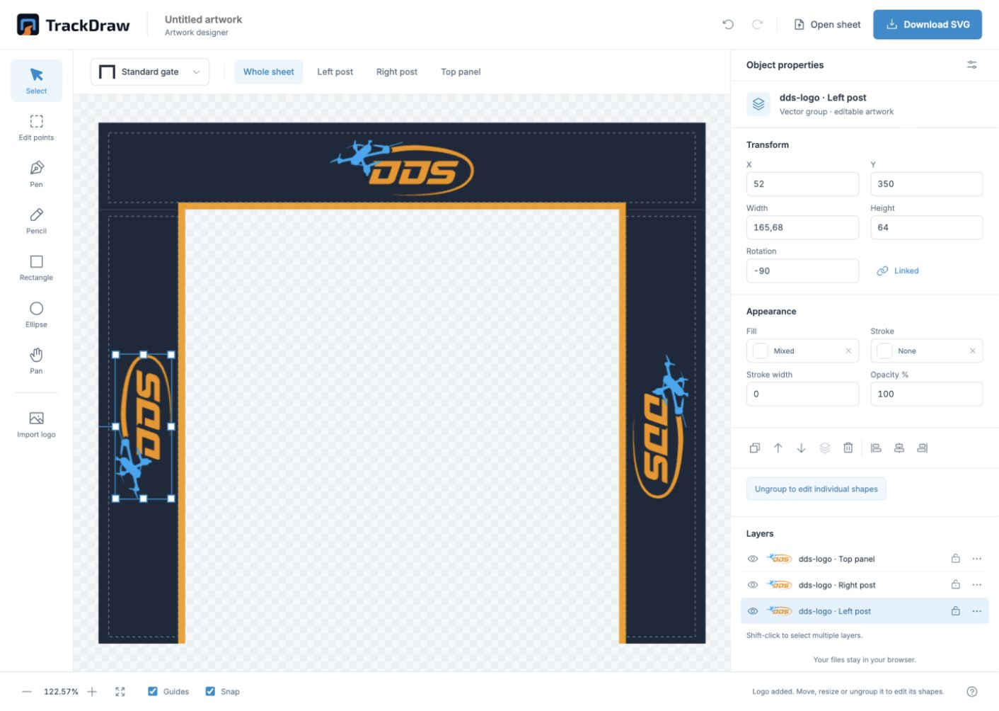

# Track assets

<!-- PROJECT SHIELDS -->
![Project Stage][project-stage-shield]
![Project Maintenance][maintenance-shield]
[![License][license-shield]](LICENSE-MIT.txt)
[![Published collections][collections-shield]][collections-url]

[![Check assets][check-shield]][check-url]
[![Publish assets][publish-shield]][publish-url]
[![npm @trackdraw/viewer][npm-shield]][npm-url]

Obstacle artwork for FPV race tracks: editable gate and flag sheets, source models and browser-ready textures used by [TrackDraw](https://trackdraw.app) and [TrackDraw Viewer](https://github.com/dutchdronesquad/track-viewer). Collections are grouped by the club, league, team or brand they represent, with their own sources, credits and usage terms.

[**Open the Artwork Designer**](https://designer.trackdraw.app) · [Contribute artwork](CONTRIBUTING.md) · [Browse collections](collections/)

<p align="center">
  <a href="https://designer.trackdraw.app">
    
  </a>
</p>

## Create obstacle artwork

The [TrackDraw Artwork Designer](https://designer.trackdraw.app) runs in your browser. Add logos, choose colours, draw and edit vectors, arrange artwork per panel and check the live 3D preview. It currently supports a standard 5×5 gate and a corner flag. No installation or TrackDraw account is needed.

1. **Design your sheet.** Choose an obstacle and add your organization's artwork.
2. **Save an editable copy.** Download the SVG before leaving; open it in the designer later to continue editing. Your files stay in your browser, and the designer does not autosave them.
3. **Submit for review.** Use **Submit artwork** to download your sheet and open the GitHub submission form. Attach the SVG and confirm the artwork's rights and usage terms there. Submission requires a GitHub account; a maintainer reviews it before publication.

See [Contributing](CONTRIBUTING.md) for the complete submission flow, or use the [SVG templates](templates/README.md) in your own vector editor. New obstacle shapes belong in TrackDraw; this repository supplies artwork for supported shapes.

## What's in this repository

- [Collections](collections/) — artwork, source models, credits and collection manifests.
- [Templates](templates/README.md) — editable SVG sheets and panel layout guidance.
- [Artwork Designer](designer/app/README.md) — the browser tool and local development instructions.
- [Scripts](scripts/) — checks, texture generation, previews and publication tooling.

## License and attribution

### Artwork and branding

Third-party artwork, logos, names and obstacle designs remain the property of their respective rights holders. Dutch Drone Squad and TrackDraw do not claim ownership or original authorship of these materials. They are included to represent recognizable obstacles in race layout planning. Their inclusion does not imply affiliation with or endorsement by the represented organizations.

Asset sources, credits and any known usage terms belong in each collection's README. Inclusion in this repository does not grant a separate license to third-party materials; their applicable rights and terms continue to apply. Keep source references and attribution with assets when adding or updating a collection.

### Software

The scripts in `scripts/`, the artwork designer in `designer/` and their tests are available under the [MIT license](LICENSE-MIT.txt). The extraction and optimization scripts originated in [TrackDraw](https://github.com/dutchdronesquad/trackdraw/tree/9a04180f3c0a0cdf85de8a8599031cf7fd994d4a) and are offered here under MIT with the copyright holder's permission. TrackDraw itself retains its own license.

The MIT license applies to this software, not to the source models, textures, third-party artwork, branding or designs in the asset collections. Hosting these materials here or using them with `@trackdraw/viewer` does not change their rights or licensing terms.

## Maintenance

Use Node.js 24:

```sh
npm ci
npm test
```

Each collection keeps its editable sources in `collections/<organization>/source/`. Template sheets there are rendered into runtime textures during checks and publication; collections that predate templates, such as MultiGP, keep committed maintenance images and runtime textures in `collections/<organization>/textures/`. Shared maintenance scripts live in `scripts/`.

Follow the collection's README when updating artwork, review the generated textures and run `npm test`. Collection-specific steps and manually maintained assets are documented there; see the [MultiGP workflow](collections/multigp/README.md) for the first collection.

TrackDraw consumes the stable hosted texture URLs. Collection discovery is additive; existing consumers do not need to load the new metadata.

## Hosted URL contract

The production URL is:

```text
https://assets.trackdraw.app/multigp/large-top-multigp.webp
```

Use `/<organization>/<filename>.webp`. These are stable, shared URLs: compatible artwork improvements update all consumers automatically. Changes requiring different rendering must use a new filename and keep the old file available. No asset version or consumer version bump is needed for compatible updates.

Runtime filenames retain their original case. Consumers need no API key. Runtime WebP textures, collection manifests and the discovery index are uploaded; source GLBs and maintenance PNGs remain in Git. Browser and CDN caching is five minutes (`public, max-age=300, must-revalidate`), so updates need no cache purge. Custom Cloudflare cache rules must not override this TTL. Uploads overwrite matching keys but do not delete other bucket objects.

## Collection metadata

See the [version 1 collection contract](docs/collection-contract.md) and the [DDS template pilot](collections/dds/README.md). Run `npm run assets:check` to validate manifests, images and template sheets, and `npm run textures:build` to write the exact publishable files to `build/`. Published collections are discoverable at `/collections.json`; examples remain in Git only.

## Related repositories

- [TrackDraw](https://github.com/dutchdronesquad/trackdraw) — design, share and export FPV race layouts using these obstacle assets.
- [TrackDraw Viewer](https://github.com/dutchdronesquad/track-viewer) ([npm](https://www.npmjs.com/package/@trackdraw/viewer)) — display and embed TrackDraw layouts in interactive, read-only 2D and 3D views.

<!-- LINKS -->
[check-shield]: https://github.com/dutchdronesquad/track-assets/actions/workflows/check.yml/badge.svg
[check-url]: https://github.com/dutchdronesquad/track-assets/actions/workflows/check.yml
[collections-shield]: https://img.shields.io/badge/dynamic/json?url=https%3A%2F%2Fassets.trackdraw.app%2Fcollections.json&query=%24.collections.length&label=published%20collections&color=blue
[collections-url]: https://assets.trackdraw.app/collections.json
[license-shield]: https://img.shields.io/badge/software%20license-MIT-blue.svg
[maintenance-shield]: https://img.shields.io/maintenance/yes/2026.svg
[npm-shield]: https://img.shields.io/npm/v/@trackdraw/viewer.svg?label=npm%20%40trackdraw%2Fviewer
[npm-url]: https://www.npmjs.com/package/@trackdraw/viewer
[project-stage-shield]: https://img.shields.io/badge/project%20stage-beta-orange.svg
[publish-shield]: https://github.com/dutchdronesquad/track-assets/actions/workflows/publish.yml/badge.svg
[publish-url]: https://github.com/dutchdronesquad/track-assets/actions/workflows/publish.yml
