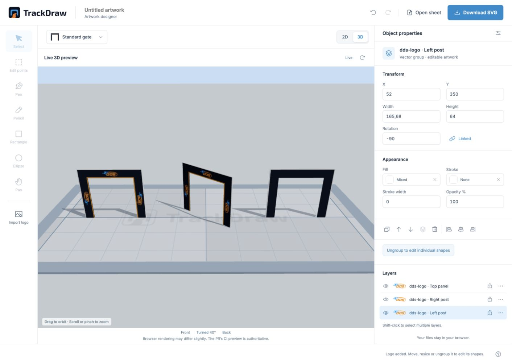
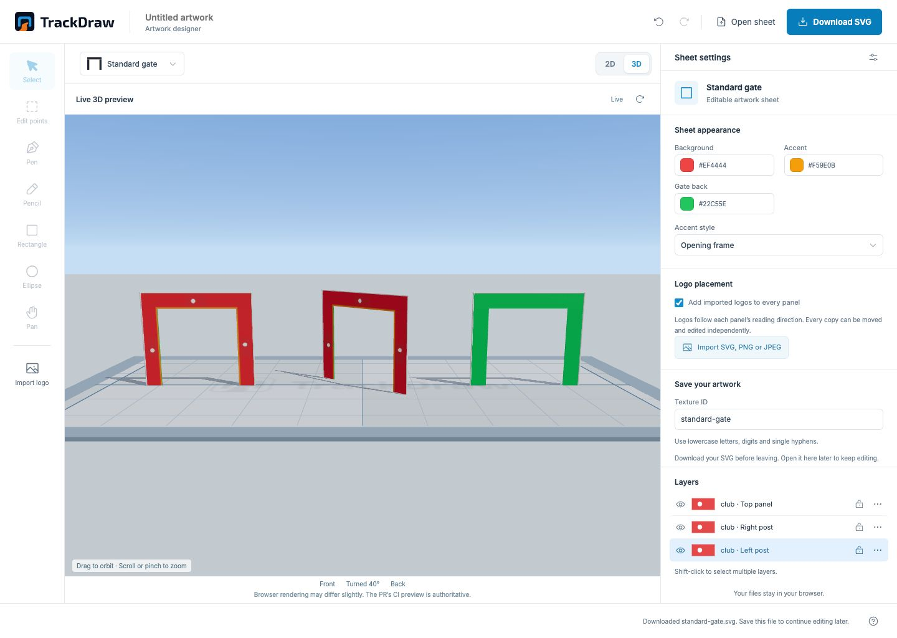
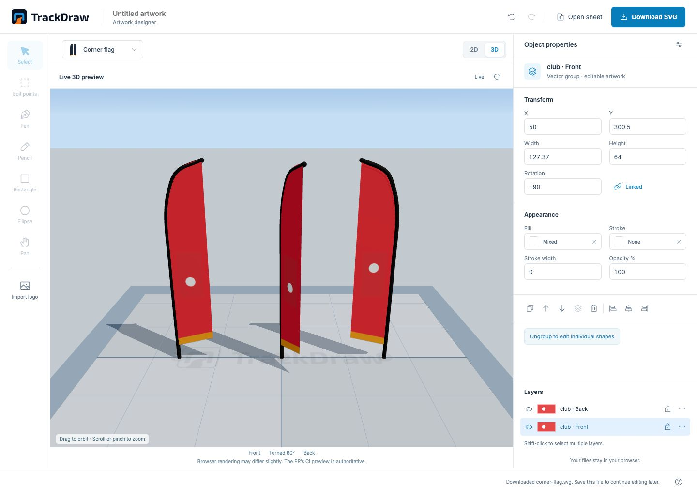
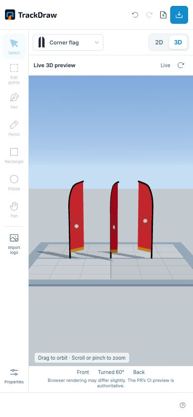

# Live 3D preview verification

Issue #34 adds a 2D/3D switch above the canvas, with a full-size live preview. The designer and CI share the render targets and camera through `templates/render-targets.ts`; the viewer extension is tracked in [track-viewer#15](https://github.com/dutchdronesquad/track-viewer/pull/15). The designer and CI use the published `@trackdraw/viewer` 1.0.2 release, which includes that extension.

Verified in the production build with Chromium software WebGL and in the in-app browser:

- Imported artwork appears on the correct gate panels and survives undo/redo while 3D remains open.
- The gate's unprinted back follows the chosen solid colour. The browser test asserts actual changed green pixels on the rendered back angle.
- Flag front/back crops preserve transparent silhouettes and the template's reading rotations. Browser panel pixels are compared with the real `exportSheet` output, allowing differences only along rasterized edges.
- Switching templates resets the preview to the correct geometry and camera. Editing artwork preserves the camera. Reset camera and switching between 2D and 3D work.
- Mobile can switch between the editable canvas and full-size live preview without horizontal overflow.
- Returning to 2D preserves the focused panel, zoom and selected artwork, with drawing available again.
- Forcing WebGL off leaves keyboard drawing, undo and downloaded SVGs usable.
- No catalog textures load from the network. Returning to 2D revokes all its panel object URLs; viewer tests verify shared-angle GPU texture disposal after the final consumer releases them.
- A clean installation and the integration checks use the published npm viewer package.

Browser rasterization can differ slightly from CI's librsvg rendering. The PR's CI preview comment remains authoritative.

## Desktop with DDS artwork

## Gate back colour

## Flag outline and angles

## Mobile

